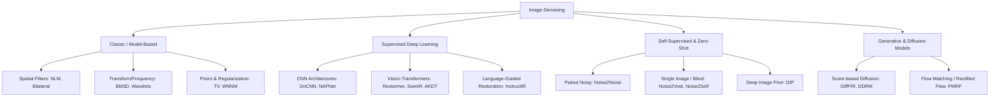

# 🖼️ Image Denoising Landscape: State-of-the-Art Models, Datasets & AI Noise Reduction

 
 

 

  <strong>The definitive curated landscape of AI image denoising research, deep learning architectures, diffusion models, real-world benchmark datasets, and online noise reduction tools.</strong>

---

## 📖 Table of Contents

- [Overview & Denoising Taxonomy](#-overview--denoising-taxonomy)
- [🚀 Featured News & SOTA Trends (2024–2026)](#-featured-news--sota-trends-20242026)
- [🧠 Deep Learning & Transformer Architectures](#-deep-learning--transformer-architectures)
- [⚡ Self-Supervised & Zero-Shot Denoising](#-self-supervised--zero-shot-denoising)
- [🎨 Diffusion & Generative Models](#-diffusion--generative-models)
- [📊 Benchmark Datasets & Metrics](#-benchmark-datasets--metrics)
- [🛠️ SaaS Products & Online AI Denoiser Tools](#️-saas-products--online-ai-denoiser-tools)
- [🔬 Classic & Traditional Denoising Methods](#-classic--traditional-denoising-methods)
- [📺 Tutorials, Surveys & Key Lectures](#-tutorials-surveys--key-lectures)
- [🤝 Contributing](#-contributing)
- [❤️ Support & Sponsorship](#️-support--sponsorship)
- [📈 Project Velocity](#-project-velocity)

---

## 📌 Overview & Denoising Taxonomy

**Image Denoising** is a foundational task in low-level computer vision and image processing. The objective is to recover a clean image $\mathbf{x}$ from a degraded observation $\mathbf{y}$:

$$\mathbf{y} = \mathbf{x} + \mathbf{n}$$

where $\mathbf{n}$ represents noise (e.g., Additive White Gaussian Noise (AWGN), Poisson-Gaussian sensor noise, shot noise, or speckle noise).

### Core Methodologies

---

## 🚀 Featured News & SOTA Trends (2024–2026)

*   **AKDT (2026 Benchmark SOTA):** [Adaptive Kernel Dilation Transformer](https://github.com/albrateanu/AKDT) establishes a new frontier in compute efficiency and high-fidelity real-world image denoising.
*   **PMRF (ICLR 2025):** [Posterior-Mean Rectified Flow](https://github.com/ohayonguy/PMRF) introduces ultra-fast, photorealistic image restoration using flow matching.
*   **NTIRE 2025 Challenge:** The [NTIRE 2025 Image Denoising Challenge](https://cvlai.github.io/ntire-2025/) highlights hybrid Vision Transformer-CNN backbones optimized for mobile NPU deployment and real-sensor RawRGB pipelines.
*   **InstructIR (ECCV 2024):** High-quality restoration guided by [natural language text prompts](https://github.com/mv-lab/InstructIR) (e.g., *"Remove high-ISO sensor noise while preserving skin details"*).
*   **SplitterNet (CVPR 2024):** [SplitterNet](https://github.com/rflepp/SplitterNet) delivers real-time on-device denoising for mobile ISP hardware architectures.

---

## 🧠 Deep Learning & Transformer Architectures

Supervised deep neural networks represent the state-of-the-art for synthetic and real-world image restoration.

| Model / Framework | Architecture Type | Key Innovation | Source Code | Research Paper | Venue / Year |
| :--- | :--- | :--- | :---: | :---: | :---: |
| **AKDT** | Transformer | Adaptive Kernel Dilation attention | [Code](https://github.com/albrateanu/AKDT) | [Paper](https://arxiv.org/abs/2410.03810) | 2026 SOTA |
| **Restormer** | Transformer | Multi-Dconv Head Transposed Attention | [Code](https://github.com/swz30/Restormer) | [arXiv:2111.09881](https://arxiv.org/abs/2111.09881) | CVPR 2022 |
| **NAFNet** | Nonlinear-Free CNN | Simple baseline without nonlinear activations | [Code](https://github.com/megvii-research/NAFNet) | [arXiv:2204.04666](https://arxiv.org/abs/2204.04666) | ECCV 2022 |
| **SwinIR** | Swin Transformer | Shifted-window self-attention restoration | [Code](https://github.com/JingyunLiang/SwinIR) | [arXiv:2108.10257](https://arxiv.org/abs/2108.10257) | ICCVW 2021 |
| **InstructIR** | Multimodal Transformer | Text-instruction guided image denoising | [Code](https://github.com/mv-lab/InstructIR) | [arXiv:2301.12213](https://arxiv.org/abs/2301.12213) | ECCV 2024 |
| **SplitterNet** | Mobile CNN | Real-time high-efficiency mobile ISP denoiser | [Code](https://github.com/rflepp/SplitterNet) | [Paper](https://openaccess.thecvf.com/content/CVPR2024/html/Flepp_SplitterNet_Efficient_and_High-Quality_Image_Denoising_on_Mobile_Devices_CVPR_2024_paper.html) | CVPR 2024 |
| **SCUNet** | Swin-CNN Hybrid | Practical blind denoising with plug-and-play priors | [Code](https://github.com/cszn/SCUNet) | [arXiv:2203.11108](https://arxiv.org/abs/2203.11108) | IJCV 2022 |
| **DnCNN** | Residual CNN | Landmark residual learning for AWGN denoising | [Code](https://github.com/cszn/DnCNN) | [IEEE TIP](https://ieeexplore.ieee.org/document/7839189) | IEEE TIP 2017 |

---

## ⚡ Self-Supervised & Zero-Shot Denoising

Approaches designed for scenarios where clean ground-truth training images are unavailable.

| Method | Paradigm | Supervision Requirements | Code / Paper |
| :--- | :--- | :--- | :---: |
| **Noise2Noise (N2N)** | Self-Supervised | Requires pairs of noisy observations of the same scene | [Code & Paper](https://github.com/NVlabs/noise2noise) |
| **Noise2Void (N2V)** | Blind-Spot Network | Single noisy images; blind-spot pixel masking | [Code & Paper](https://github.com/juglab/n2v) |
| **Noise2Self (N2S)** | Blind-Spot Network | Self-supervised single-shot blind denoising framework | [Code & Paper](https://github.com/joshreuben/noise2self) |
| **Deep Image Prior (DIP)** | Zero-Shot / Unsupervised | No training dataset; network architecture acts as regularizer | [Code & Paper](https://github.com/DmitryUlyanov/deep-image-prior) |
| **Neighbor2Neighbor** | Random Sub-sampling | Single noisy images with neighbor sub-sampler | [Code & Paper](https://github.com/TaoHuang2018/Neighbor2Neighbor) |

---

## 🎨 Diffusion & Generative Models

Generative models and score-based diffusion methods excel at recovering fine textures and complex stochastic details.

*   **PMRF (ICLR 2025):** [Posterior-Mean Rectified Flow](https://github.com/ohayonguy/PMRF) - High-perceptual quality image restoration and denoising using optimal transport flow matching.
*   **DiffPIR (IEEE TPAMI 2023):** [Diffusion Models as Plug-and-Play Priors](https://github.com/yuanzhi-zhu/DiffPIR) - Zero-shot image restoration leveraging pre-trained diffusion priors.
*   **DDRM (NeurIPS 2022):** [Denoising Diffusion Restoration Models](https://github.com/bahjat-kawar/ddrm) - General inverse problem solver with unsupervised diffusion guidance.
*   **Cold Diffusion (NeurIPS 2022):** [Cold Diffusion](https://github.com/arpitbansal297/Cold-Diffusion-Models) - Generalized diffusion inversion applicable to arbitrary deterministic and non-Gaussian degradations.

---

## 📊 Benchmark Datasets & Metrics

### Standard Denoising Datasets

| Dataset | Modality | Noise Characteristics | Resolution / Samples | Best For | Link |
| :--- | :--- | :--- | :--- | :--- | :---: |
| **SIDD** | Smartphone RawRGB / sRGB | Real sensor shot & read noise | 30,000 real noisy/clean pairs | Smartphone Denoising Benchmark | [SIDD](https://www.eecs.yorku.ca/~kamel/sidd/) |
| **DND** | DSLR RawRGB / sRGB | Real camera noise (low/high ISO) | 50 high-res uncompressed scenes | Standard Research Benchmark | [DND](https://enhance.ee.tut.fi/dnd/) |
| **PolyU** | Real Camera sRGB | Realistic multi-brand sensor noise | High-resolution real photos | Cross-sensor Evaluation | [PolyU](https://github.com/csjunxu/PolyU-Real-World-Noisy-Images-Dataset) |
| **BSDS500** | RGB / Grayscale | Synthetic AWGN ($\sigma \in [15, 25, 50]$) | 500 benchmark natural images | Classic Synthetic Evaluation | [BSDS](https://www2.eecs.berkeley.edu/Research/Projects/CS/vision/bsds/) |
| **Kodak24** | Uncompressed RGB | Synthetic Gaussian / Poisson | 24 classic photo test images | Fast Method Comparison | [Kodak](http://r0k.us/graphics/kodak/) |
| **Set12 / McMaster** | Grayscale / Color | Synthetic Gaussian noise | Standard legacy benchmark sets | Baseline Algorithmic Validation | [Set12](https://github.com/cszn/DnCNN) |

### Key Performance Evaluation Metrics

*   **PSNR (Peak Signal-to-Noise Ratio):** Standard fidelity metric measuring reconstruction accuracy in decibels (dB).
*   **SSIM (Structural Similarity Index):** Assesses structural information preservation and perceptual luminance/contrast.
*   **LPIPS (Learned Perceptual Image Patch Similarity):** Deep feature distance quantifying human perceptual similarity.
*   **NIQE & BRISQUE:** No-reference image quality metrics for real-world blind image quality evaluation.

---

## 🛠️ SaaS Products & Online AI Denoiser Tools

| SaaS Product | Focus & Key Capabilities | Free Tier Limits | Pricing / Plans | Official Link |
| :--- | :--- | :--- | :--- | :---: |
| **Topaz Photo AI** | Pro-grade RAW sensor noise reduction, detail recovery, and sharpening | No perpetual free tier (free watermarked trial available) | $199 one-time license (1 yr updates) | [Topaz Labs](https://www.topazlabs.com/topaz-photo-ai) |
| **LetsEnhance.io** | Cloud-based AI denoiser, unblur, and upscaler for e-commerce and creative workflows | Free account includes 10 credits upon signup | Subscriptions from $9/mo (100 credits) to $24/mo (500 credits); Pay-as-you-go available | [LetsEnhance](https://letsenhance.io/) |
| **VanceAI Denoiser** | Deep-learning Denoise AI specialized in high-ISO portrait and low-light noise removal | 3 free credits on signup | Plans start at $4.95/mo (100 credits) up to $99.90 lifetime license | [VanceAI](https://vanceai.com/denoise-ai/) |
| **Clipdrop by Jasper (Cleanup & Denoise)** | AI web tools for noise suppression, background removal, and resolution enhancement | Free tier with watermarked/limited resolution exports | Pro plan from $7.00/mo (annual billing) or $13.00/mo | [Clipdrop](https://clipdrop.co/) |
| **Fotor AI Image Denoiser** | Fast single-click browser denoiser for grain reduction and digital photo cleanup | Free basic tier with watermarks / standard quality | Pro starts at $3.33/mo ($39.99/year); Pro+ at $7.49/mo | [Fotor](https://www.fotor.com/features/denoise/) |
| **Hugging Face Spaces** | Open-access community demos of SOTA models (Restormer, NAFNet, SCUNet, InstructIR) | 100% Free CPU/T4 community compute instances | Free; GPU hardware upgrades from $0.60/hr | [HF Spaces](https://huggingface.co/spaces?q=denoising) |

---

## 🔬 Classic & Traditional Denoising Methods

Fundamental non-deep learning algorithmic foundations of image noise reduction:

*   **BM3D (Block-Matching and 3D Filtering):** The premier classical benchmark utilizing non-local patch grouping and 3D transform domain shrinkage. [[Paper]](https://webpages.tuni.fi/foi/GCF-BM3D/) [[Python Lib: `bm3d`]](https://pypi.org/project/bm3d/)
*   **Non-Local Means (NLM):** Spatial filtering method averaging pixels weighted by patch similarity. [[Paper]](https://ieeexplore.ieee.org/document/1467423)
*   **WNNM (Weighted Nuclear Norm Minimization):** Low-rank matrix approximation method for non-local image patch regularized denoising. [[Paper]](https://www.cv-foundation.org/openaccess/content_cvpr_2014/html/Gu_Weighted_Nuclear_Norm_2014_CVPR_paper.html)
*   **Total Variation (TV / Rudin-Osher-Fatemi):** Convex optimization technique preserving sharp edges while penalizing total gradient variation. [[Paper]](https://www.sciencedirect.com/science/article/pii/016727899290242F)

---

## 📺 Tutorials, Surveys & Key Lectures

*   **Comprehensive Surveys:**
    *   *Deep Learning for Image Denoising: A Survey* (IEEE TNNLS) – Comprehensive categorization from AWGN to real noise models.
    *   [Awesome-Low-Level-Vision](https://github.com/Kobaayyy/Awesome-Low-Level-Vision) – Continual tracker of CVPR, ICCV, ECCV, and ICLR low-level vision papers.
*   **Lectures & Demos:**
    *   [Noise2Noise: Official NVIDIA Technical Breakdown](https://www.youtube.com/watch?v=P0fMwA3X5KI) – Understanding neural restoration without clean target data.
    *   [Image Restoration with Vision Transformers](https://www.youtube.com/watch?v=kYI6w6y029M) – Architectural deep dive into Restormer and channel-wise self-attention.
*   **Research Paper Aggregators:**
    *   [Papers with Code: Image Denoising Leaderboards](https://paperswithcode.com/task/image-denoising) – Real-time leaderboard on SIDD, DND, and BSD68 benchmarks.
    *   [ArXiv Sanity Preserver: Low-Level Vision & Denoising](http://www.arxiv-sanity.com/search?q=image+denoising) – Daily indexed preprints.

---

## 🤝 Contributing

Contributions are warmly welcomed! Help keep this landscape up to date with the latest 2026 breakthroughs:

1. **Fork the Repository**
2. **Create a Feature Branch:** `git checkout -b feature/Add-New-Denoising-Method`
3. **Commit your Changes:** `git commit -m 'Add: New Transformer-based Denoising Paper (CVPR 2026)'`
4. **Push to Branch:** `git push origin feature/Add-New-Denoising-Method`
5. **Submit a Pull Request**

Please ensure new entries include links to both the open-source code repository and the published paper/arXiv preprint.

---

## ❤️ Support & Sponsorship

If this curated repository assists your computer vision research, engineering pipeline, or commercial projects, please consider starring ⭐ the repository and supporting maintenance:

*   **PayPal:** [Donate via PayPal](https://www.paypal.me/ishandutta2007)
*   **Bitcoin (BTC):** `3LZazKXG18Hxa3LLNAeKYZNtLzCxpv1LyD`

---

## 📈 Project Velocity

---

**SEO & Discovery Keywords:**  
*Image Denoising, AI Noise Reduction, Deep Learning Image Restoration, Vision Transformers, Restormer, NAFNet, SwinIR, InstructIR, PMRF, AKDT, SplitterNet, Noise2Noise, Noise2Void, Self-Supervised Denoising, Diffusion Models for Image Restoration, DiffPIR, Real-World Noise Benchmark, SIDD Dataset, DND Benchmark, BM3D, RawRGB Denoising, Computer Vision, CVPR 2026, ECCV, ICLR, NTIRE 2025.*

